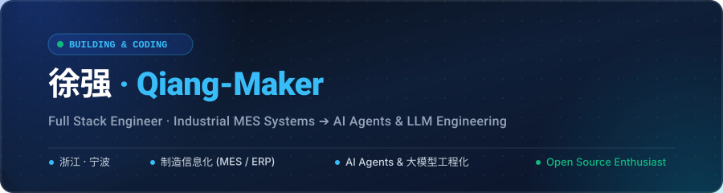

<!-- ======================= BANNER ======================= -->

  

> **扎根实体制造业务的泥土，望向大模型与智能体的星辰。**
> 从工厂生产流水线的稳定闭环，到 AI Agent 与万物重塑的工程实战。

  
  
  
  

---

### 📌 关于我 (About Me)

- 🏭 **工业实体底色**：长期负责实体制造现场的生产工单系统（MES）、ERP 对接与开票系统，保障高可用排产、全流程追踪与精准闭环；
- 🤖 **大模型与智能体转型**：正全力投入 **AI Agent（智能体）、LLM 大模型工程化**，探索让 AI 深入实体业务与终端工具的技术落地；
- 📖 **开源沉淀**：主理 [ai-handbook](https://github.com/Qiang-Maker/ai-handbook) 知识库，持续跟踪 LiteLLM、OpenHands 等顶级开源项目；
- 📬 **联系方式**：`xuqiang5250@163.com` ｜ GitHub: [@Qiang-Maker](https://github.com/Qiang-Maker)

---

### 🛠️ 技术栈 (Tech Stack)

#### 💻 编程语言 & 框架

  

#### 🗄️ 数据库 & 中间件 & 基础设施

  

---

### 🌟 焦点项目与实战 (Featured Works)

<table>
  <tr>
    <td width="50%" valign="top">
      <h3>🤖 <a href="https://github.com/Qiang-Maker/ai-handbook">ai-handbook</a></h3>
      
<b>大模型与智能体工程化全景技术手册</b>

      
系统化梳理 AI Agent 架构、Function Calling、大模型微调部署与工程实战，打造体系化的技术全景树与实践复盘。

      

        
        
      

    </td>
    <td width="50%" valign="top">
      <h3>🏭 工业系统与智能工单 (MES / ERP)</h3>
      
<b>实体制造生产管理与企业级对接平台</b>

      
服务实体工业生产场景，实现工厂工单全生命周期追踪、ERP 深度业务集成对接及高稳定性自动化开票闭环。

      

        
        
      

    </td>
  </tr>
  <tr>
    <td width="50%" valign="top">
      <h3>🌐 <a href="https://github.com/Qiang-Maker/liuyuyang">liuyuyang (Personal Portfolio)</a></h3>
      
<b>基于 Next.js 与 TypeScript 的高体验个人主页</b>

      
基于 Next.js 16 + React 19 + TailwindCSS 4 构建，呈现流畅自然的交互设计与高质量组件工程实践。

      

        
        
      

    </td>
    <td width="50%" valign="top">
      <h3>🤝 AI 生态与开源贡献</h3>
      
<b>积极参与 AI Gateway 与 Agent 基础设施社区</b>

      
持续跟踪与研究 LiteLLM、OpenHands 等顶级 AI 智能体开源生态，积极参与 Issue 调研与工程实践。

      

        
      

    </td>
  </tr>
</table>

---

### 📈 GitHub 动态看板

  
  &nbsp;&nbsp;
  

---

  📫 欢迎技术交流与开源协作 · Email: <b><a href="mailto:xuqiang5250@163.com">xuqiang5250@163.com</a></b>

